# LoRA Prep Suite

LoRA Prep Suite is a desktop application for preparing image datasets for LoRA training.

It automates the most time-consuming parts of dataset preparation:

- Cropping images into consistent framing categories
- Checking resolution quality before training
- Removing weak or unusable images quickly
- Sorting files into Kohya-style subfolders
- Renaming images and generating caption files fast

Everything runs locally. No uploads. No cloud services.

<div align="center">
  <a href="assets/Crop_Studio.JPG">
    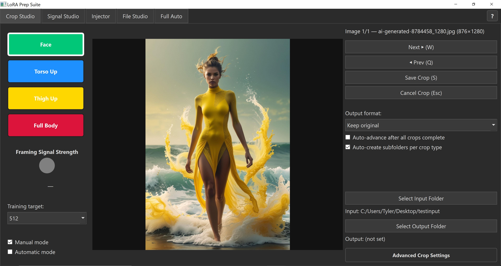
  </a>
</div>

---

## What Is LoRA Prep Suite?

When training a LoRA (Low-Rank Adaptation) model, the quality and consistency of your dataset directly determines how well your model performs. Most people spend hours manually cropping images, checking resolution quality, sorting files into folders, renaming them, and writing captions — all before a single training step runs.

LoRA Prep Suite automates all of that. It gives you five dedicated tools that follow the exact workflow a dataset preparer would use, plus a Full Auto mode that runs the entire pipeline in one click.

If you've ever finished a LoRA training run only to discover the model is soft, inconsistent, or distorted at certain distances — your dataset was the problem. LoRA Prep Suite exists to fix that before training even begins.

## At a Glance

- 5 standalone tools for dataset preparation
- Full Auto one-click pipeline
- Resolution-aware grading system
- Automatic crop culling based on signal strength
- Works with Kohya SS style dataset structures
- Fully local processing. No uploads, no cloud

While sequential cropping is a supported workflow, each tool works independently and can be used for general dataset preparation tasks. You do not need to use sequential cropping to benefit from LoRA Prep Suite.

---

## Who Is This For?

LoRA Prep Suite is useful for a wide range of people, not just those doing full sequential cropping workflows. Each tool can be used on its own:

- **Anyone training a LoRA** on a person, character, object, style, or subject using Kohya SS or similar trainers
- **Anyone with a folder of images** that needs to be renamed, numbered, and captioned consistently — File Studio works on any images regardless of how they were created
- **Anyone who needs to sort images into dataset subfolders** by type — the Injector works on any set of keyword-named files
- **Anyone who wants to know if their dataset will train well** before committing hours to a training run — Signal Studio grades your entire dataset in seconds
- **People doing sequential cropping** to build framing data for a subject (see below)
- **Anyone who wants the full pipeline automated** from raw images to a finished dataset without touching each tool individually

You do not need to use all five tools. Pick the ones that solve your problem.

---

## Sequential Cropping — What It Is and Why It Matters

Sequential cropping is a niche but useful technique in LoRA dataset preparation, particularly for subject LoRAs (a specific person, character, or figure) where the available image set is limited, portrait-heavy, or face-dominant.

The core idea: if most of your training images are close-up headshots or portraits, your model will learn that subject's face well but may struggle to generate them at medium distance, full body, or in different framings. Generations that ask for a full body or 3/4 shot may produce inconsistent results because the model simply never saw the subject at those distances during training.

Sequential cropping addresses this by taking each source image and producing multiple crops at different zoom levels from a single photo — a face crop, a torso crop, a thigh crop, and a full body crop. Each of these becomes a separate training image representing the same subject at a different framing distance. When added to the dataset, they introduce what is sometimes called **framing data** — examples that teach the model what the subject looks like at various distances and compositions.

**The ML reasoning behind it**

Sequential cropping is not an officially named technique in LoRA communities. It is an intentional application of established computer vision principles to LoRA fine-tuning:

**Multi-scale training** is standard practice in computer vision. Models trained on the same subject at different scales learn how identity behaves when small in frame versus large in frame — a property called scale invariance. This is used extensively in object detection, segmentation, and face recognition.

**Curriculum / hierarchical supervision** is the second principle at work. Because all four crops come from the same source image, the model receives the same identity, the same lighting, the same pose, and the same pixel statistics — just with different spatial emphasis. This teaches the network that the subject is the same person whether their face occupies 5% or 70% of the frame. That is something a randomly assembled dataset of unrelated images cannot reliably provide.

**Scale consistency learning** is what makes this specifically valuable over just gathering more diverse images. The matched context and matched embeddings across crops make the scale relationships cleaner and reinforce identity representation across spatial scales more directly than unrelated shots at different distances would.

This matters because a LoRA modifies weights inside a diffusion UNet that is architecturally built around multi-resolution feature maps — it already processes images at multiple downsample scales internally. Exposing it to the same identity at different spatial occupancies reinforces identity representation across those feature map levels. That is not speculation; it is how CNN-based systems behave.

There is no research paper titled "sequential cropping improves LoRA." But there is substantial research showing multi-scale augmentation improves robustness, scale-consistent supervision improves recognition stability, and object detection models benefit from scale-balanced training. LoRA fine-tuning sits on top of the same visual backbone principles, so the logic transfer is mechanically valid — not just a cool idea.

**Why it specifically helps with face distortion at distance**

The most common failure mode this technique targets is: good close-up face quality, good body shape, but face distorts or loses identity when small in frame. This happens because the model has not learned strong low-resolution identity anchors. When a face only occupies a small patch of the image, the signal competes with background, identity gradients are weaker, and the UNet falls back on generic small-face priors. Sequential cropping increases the frequency of "small face but still this identity" training examples, which strengthens that mapping.

**What it does not fix**

Sequential cropping only addresses scale-based identity instability. It will not fix identity collapse from overfitting, poor base image quality, bad bucket resolution mismatches, or overtrained rank issues. The crops also need to be high quality and at meaningfully different scales, otherwise it just becomes duplication.

**When sequential cropping is most useful:**
- Your dataset is mostly portraits or headshots and you want better full-body or medium-shot generations
- You have a small dataset and want to expand it with consistent derived crops from existing images
- Your subject has very few full-body or medium-shot reference images available

**When it may not be necessary:**
- Your dataset already has good variety across shot types and distances
- You are training a style LoRA, object LoRA, or concept that does not involve a specific subject at different framings

Crop Studio and Full Auto both support sequential cropping out of the box using MediaPipe pose detection to automatically identify the correct crop regions for each framing level.

While sequential cropping is a powerful technique for subject-based LoRAs, it is optional. Crop Studio, Signal Studio, Injector, and File Studio all function independently and can be used for standard dataset cleanup, organization, grading, and preparation workflows unrelated to framing-based training.

---

## Installation

**Requirements:**
- Python 3.10+
- Windows (tested), macOS and Linux should work
- A virtual environment is recommended

### Option 1 — Double-click to launch (Windows, no CLI needed)

Simply double-click `launch.bat` in the project folder. It activates the virtual environment and starts the app automatically. No terminal required.

### Option 2 — Command line

```bash
git clone https://github.com/yourname/lora-prep-suite.git
cd lora-prep-suite
python -m venv .venv

# Windows
.venv\Scripts\activate

# macOS / Linux
source .venv/bin/activate

pip install -r requirements.txt
python main.py
```

---

## Built-In Help

<div align="center">
  <a href="assets/HelpButton.JPG">
    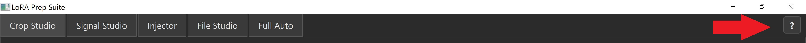
  </a>
</div>

Every tab in LoRA Prep Suite includes a **Help button** in the **top-right corner**.

If you’re unsure how a specific tab works, use the built-in Help button before running the tool. 

The README explains the overall workflow, while the in-app Help explains the details of each tab.

## The Five Tools

### 1. Crop Studio

<div align="center">
  <a href="assets/Crop_Studio_Indicator.JPG">
    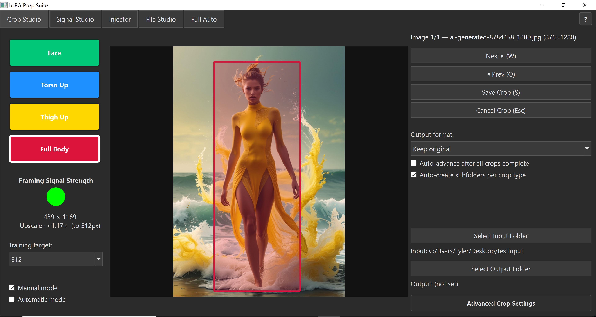
  </a>
</div>

Crop Studio is where you load your source images and crop them into whatever categories your dataset needs. It supports both manual and automatic cropping using MediaPipe pose detection for body-based crops.

The crop types are fully customizable — the defaults cover face, torso, thigh-up, and full body for sequential cropping workflows, but you can rename them, change their colors, and add up to 4 additional custom types for any other use case. Crop Studio is not limited to people or body parts. It works on any images and any crop categories you define then neatly puts them in their own subfolders.

**Default crop types:**
- Full body
- Thigh-up (3/4 shot)
- Torso (chest up)
- Face (headshot)

**How to use:**
1. Select a folder of source images
2. Select an output folder where crops will be saved
3. Use the **Q** and **W** or click to navigate between images
4. Switch to auto-crop which uses pose detection, or manually drag the crop box in manual mode
5. Press **1–4** (or **5–8** for custom types) to switch between crop categories
6. Press **S** to save the current crop and advance to the next image

### Automatic Crop Mode

When **Auto Crop** is enabled:

- MediaPipe pose detection identifies key body landmarks  
- Crop regions are calculated automatically for each defined category  
- Each crop type is generated in one pass  
- You can review and adjust before saving if needed  

Auto Crop is designed for fast, structured dataset generation — especially useful for sequential cropping workflows.

<div align="center">
  <a href="assets/Crop_Studio_AUTO.JPG">
    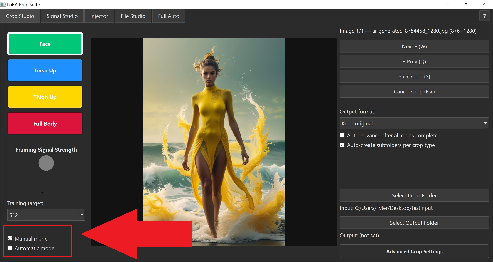
  </a>
  <a href="assets/Crop_Studio_AUTO2.JPG">
    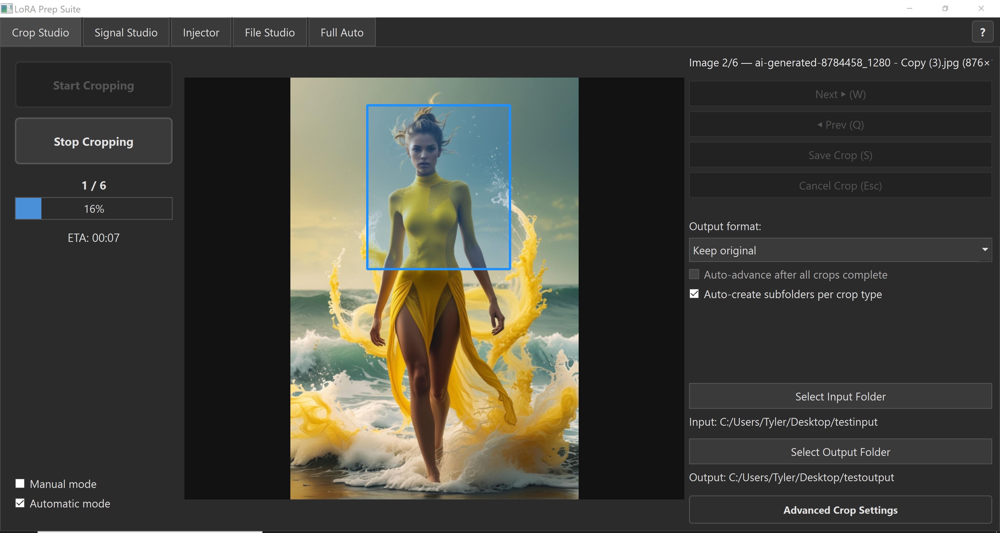
  </a>
</div>

---

### Manual Crop Mode

In manual mode:

- You drag and position the crop box yourself  
- Switch between crop categories using **1–4** (or **5–8** for custom types)  
- You control framing completely  

If **Auto Advance** is enabled in manual mode, the program will:

- Only advance to the next image after all active crop categories have been saved  
- Prevent accidental skipping  
- Ensure complete crop sets per image  

This keeps sequential sets consistent without forcing you to manually track which categories are done.

If Auto Advance is off, you can move between images freely.

**Framing Signal Strength** shows in real time how clean the crop will be at your target training resolution.

The indicator is color-coded:

Green — Strong native resolution, safe to train
Yellow — Acceptable, moderate upscaling
Orange — Risky, heavy upscaling
Red — Weak signal, likely degraded training data

This allows you to make informed decisions before saving.

**Custom crop types** can be added via the Advanced Crop Settings button, letting you define additional crop categories with custom names and colors.

<div align="center">
  <a href="assets/Crop_Studio_Custom_Crops.JPG">
    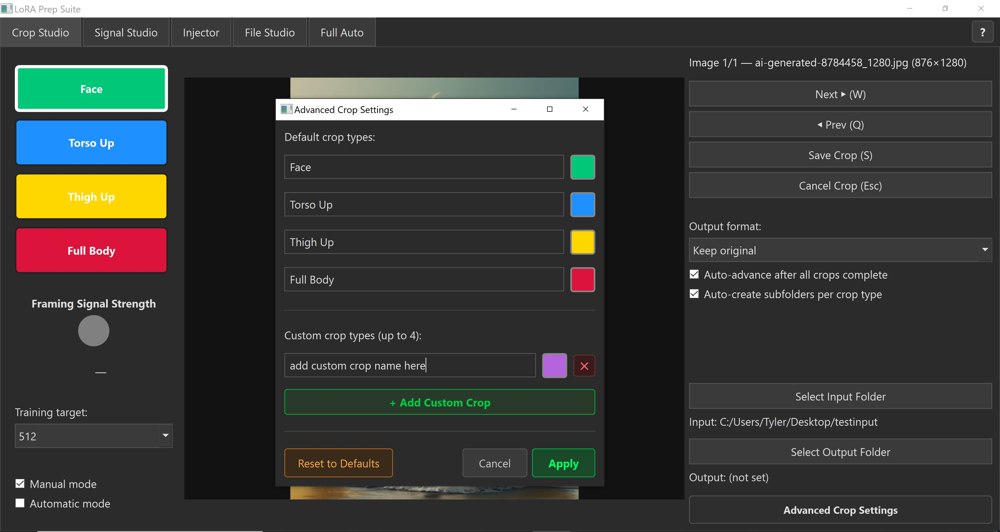
  </a>
  <a href="assets/Crop_Studio_Color_Picker.JPG">
    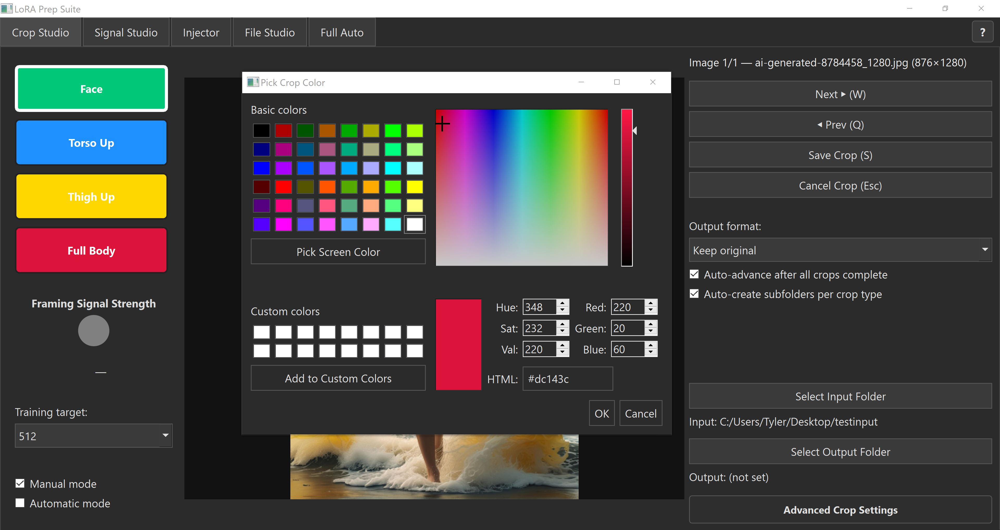
  </a>
</div>

---

### 2. Signal Studio

<div align="center">
  <a href="assets/Signal_Studio.JPG">
    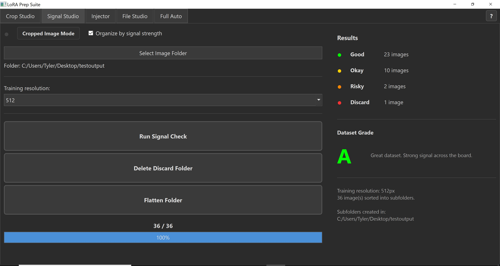
  </a>
</div>

Signal Studio grades an entire folder of images at once and tells you how training-ready it is. Every image is scored based on how much upscaling would be required to reach your target training resolution. The less upscaling needed, the cleaner the training signal.

**Tiers:**
| Tier | Upscale Ratio | Meaning |
|------|--------------|---------|
| Good | ≤ 1.70× | Strong signal, will train cleanly |
| Okay | ≤ 2.50× | Acceptable, minor quality loss |
| Risky | ≤ 3.50× | Significant upscaling, may affect quality |
| Discard | > 3.50× | Too small, not recommended for training |

**Dataset Grade** is an overall letter grade (A through F) summarizing signal quality across the entire folder.

**How to use:**
1. Select your dataset folder
2. Set your training resolution (e.g. 512, 768, 1024)
3. Click **Run Signal Check**
4. Optionally enable **Organize by signal strength** to automatically sort images into tier subfolders
5. Use **Delete Discard Folder** to permanently delete the discard folder and any discard ranked images inside.
6. Use **Flatten Folder** to merge everything back into a flat folder if needed

Signal Studio also supports **Cropped Mode**, which grades only the cropped images (files ending in `_C`) so you can evaluate your crops separately from your source images.

---

### 3. Injector

<div align="center">
  <a href="assets/Injector.JPG">
    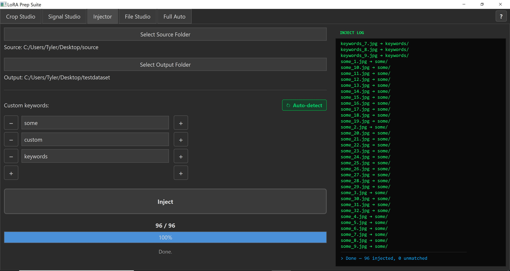
  </a>
</div>

The Injector sorts images into the correct subfolders of your dataset based on keywords in their filenames. If you have a dataset folder with subfolders like `10_face`, `15_torso`, `12_thigh`, and `8_fullbody`, the Injector reads each image's filename, matches it to the right subfolder by keyword, and moves it there automatically.

This tool is useful on its own for anyone who has a set of keyword-named images and needs them organized into a folder structure. It is not limited to crops or sequential cropping workflows.

**Default keywords:** face, torso, thigh, fullbody

**Custom Keywords & Auto Detect**

<div align="center">
  <a href="assets/AnimationInject.gif">
    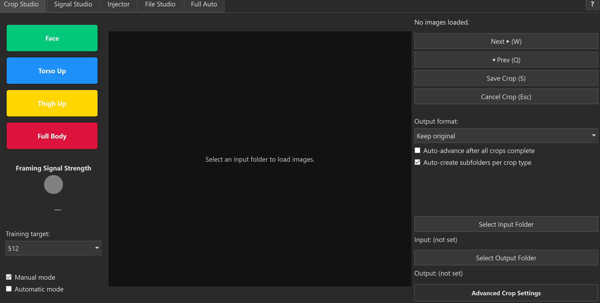
  </a>
</div>

When Auto Detect is enabled, Injector automatically reads the crop type names defined in Crop Studio and injects them into the custom keyword fields automatically.

This includes:

- Renamed default crop buttons  
- Any additional custom crop types you created  

If a crop type is not one of the default categories (Face, Torso, Thigh, Full Body), it is treated as a custom crop keyword.

Auto Detect automatically populates the custom keyword fields in Injector using the exact names defined in Crop Studio, ensuring both tools stay synchronized.

This eliminates the need to manually re-enter custom crop names and reduces configuration errors when working across multiple sessions or datasets.

**How to use:**
1. Select your source folder (images to inject)
2. Select your LoRA dataset folder (the one with subfolders you're using for training)
3. Optionally customize the 8 keyword slots to match your own naming conventions
4. Enable **Auto-detect from Crop Studio** to pull keyword settings automatically
5. Click **Inject**

The terminal log on the right shows every file moved in real time. Green for successful matches, orange for unmatched files.

Files that can't find a home due to a file name keyword(s) not matching up with a subfolder name(s) will be put in a "unmatched" folder for review.

---

### 4. File Studio

<div align="center">
  <a href="assets/File_Studio.JPG">
    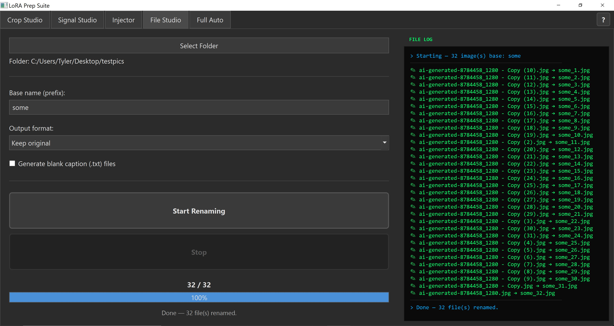
  </a>
  <a href="assets/File_Studio2.JPG">
    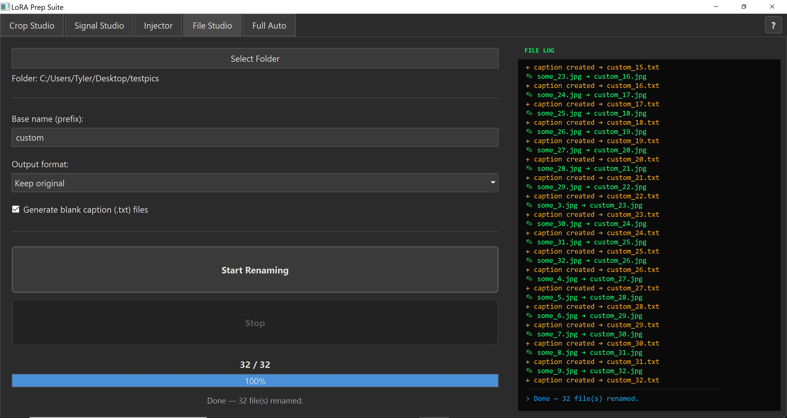
  </a>
</div>

File Studio handles bulk renaming, format conversion, and caption file generation. It works on any folder of images regardless of where they came from or how they were named. You do not need to have used any other tool in LoRA Prep Suite to use File Studio.

**Features:**
- Rename all images in a folder sequentially with a custom prefix (e.g. `face_1.png`, `face_2.png`)
- Convert between PNG and JPG
- Automatically generate blank `.txt` caption files for every image that doesn't already have one
- Rename existing caption files to match their corresponding renamed image

**How to use:**
1. Select the folder to process
2. Enter a base name prefix
3. Choose output format
4. Check **Generate blank caption files** if needed
5. Click **Start Renaming**

---

### 5. Full Auto

Full Auto runs the entire pipeline.

Crop, signal check, inject, rename; all in one click. It is designed for people who do want to use sequential cropping and have a set of source images and want to go straight to a finished, organized, renamed, captioned dataset without running each tool individually.

**How to use:**
1. Select your **Input Folder** — source images to crop from
2. Select your **Staging Folder** — a temporary working folder where crops are held during the pipeline
3. Select your **LoRA Dataset Folder** — your main dataset with subfolders already created (e.g. `10_face`, `15_torso`)
4. Set your training resolution
5. Click **▶ Run Full Auto Pipeline**

**The 4 phases:**

**Phase 1 — Auto Crop**

MediaPipe detects the pose in each image and generates 4 sequential crops: full body, thigh, torso, and face. Each crop is saved to the staging folder with a `_C` suffix marking it as a crop.

Each image has 4 crops as previously stated. This is called a "set."

<div align="center">
  <a href="assets/FullAutoP1.JPG">
    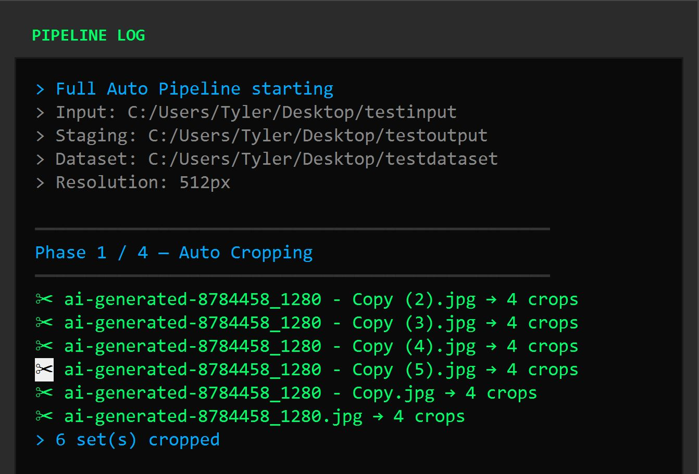
  </a>
</div>


**Phase 2 — Signal Check & Cull**

Every set of crops is graded using the same upscale ratio math as Signal Studio or the Framing Signal Strength in Crop Studio. Discard-quality crops are always removed immediately. If a set has fewer than 3 Good or Okay crops remaining, or more than 1 Risky crop, the entire set is deleted. Only clean sets continue to ensure strong LoRA training.

The terminal shows each passing set with individual crop grades color-coded by tier. The set name itself is colored based on the average upscale ratio across all kept crops. It's a mathematical representation of how that full set is expected to perform during training.

<div align="center">
  <a href="assets/FullAutoP2.JPG">
    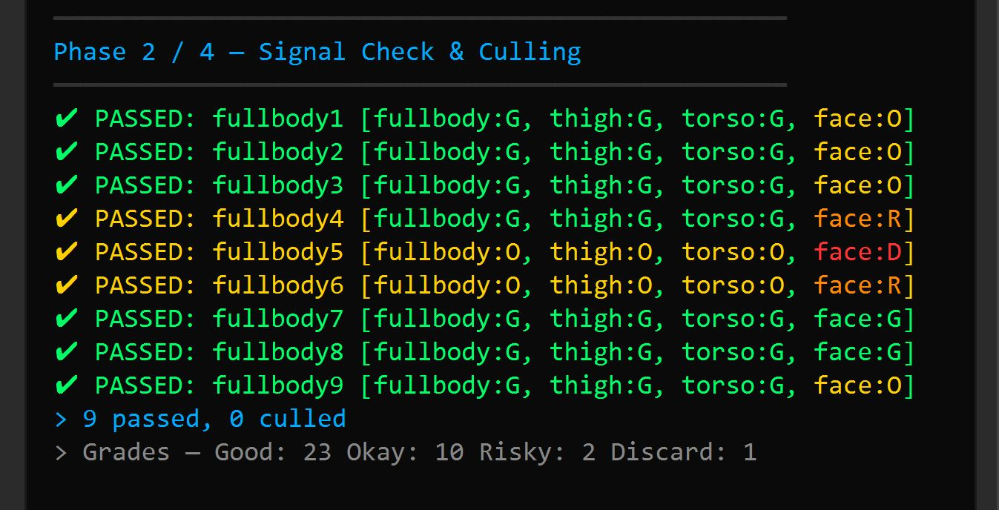
  </a>
</div>


**Phase 3 — Inject**

Passing crops are moved into the correct subfolders of your dataset based on crop type keyword matching.

<div align="center">
  <a href="assets/FullAutoP3.JPG">
    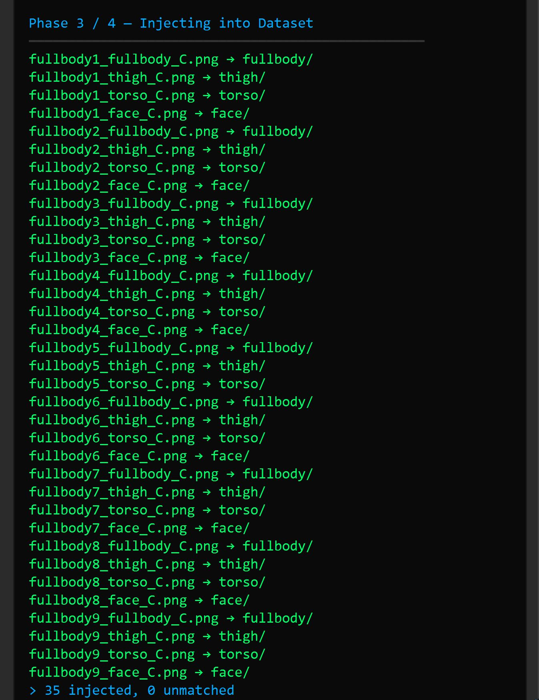
  </a>
</div>


**Phase 4 — Rename & Captions**

All images in each subfolder are renamed sequentially using the subfolder name as a prefix, with the `_C` suffix preserved. Blank caption files are created for every new image.

<div align="center">
  <a href="assets/FullAutoP4.JPG">
    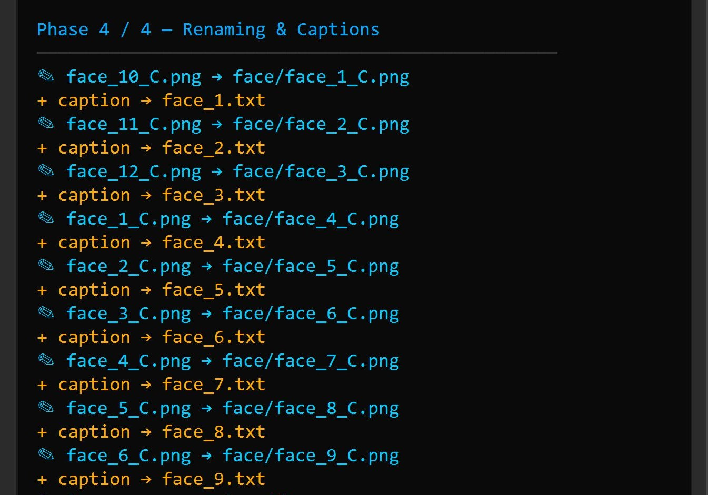
  </a>
</div>


**IN ACTION**
<div align="center">
  <a href="assets/Animation.gif">
    
  </a>
</div>

---

## Workflow Overview

The intended end-to-end workflow:

```
Source images
      ↓
[ Crop Studio ]     — crop into categories at different framings
      ↓
[ Signal Studio ]   — grade your crops, identify and cull weak images
      ↓
[ Injector ]        — sort crops into dataset subfolders by type
      ↓
[ File Studio ]     — rename, convert format, generate captions
      ↓
Training-ready dataset
```

Or use **Full Auto** to run the entire thing automatically.

Each tool also works independently. You can use just the Injector to sort files, just File Studio to rename an entire folder of files, or just Signal Studio to evaluate an existing dataset.

<div align="center">
  <a href="assets/Pipeline.png">
    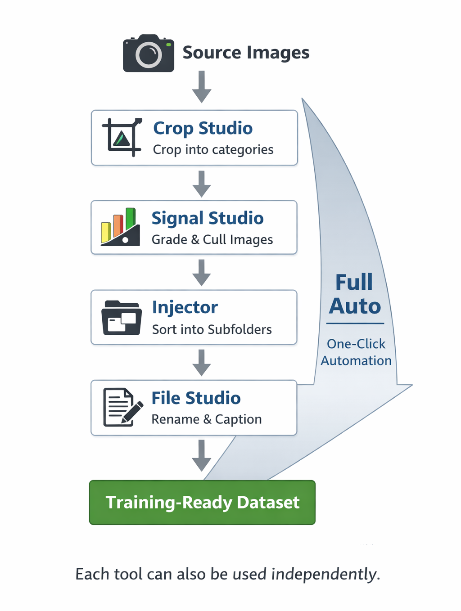
  </a>
</div>

---

## Training Resolution Guide

The training resolution you choose affects how every signal grade is calculated across the entire app. 512px is the standard for most LoRA training.

| Resolution | Recommended for |
|-----------|----------------|
| 512 | Standard LoRA training, most common |
| 768 | Higher detail, requires larger source images |
| 1024 | High-res training, source images must be high resolution |

As a general rule: if most of your images land in the **Good** tier at your chosen resolution, you have a strong dataset.

---

## File Naming Convention

Crops produced by Crop Studio and Full Auto follow this pattern:

```
{original_stem}_{crop_type}_C.png
```

For example:
```
photo001_face_C.png
photo001_torso_C.png
photo001_thigh_C.png
photo001_full_C.png
```

After File Studio or Full Auto Phase 4 renaming:
```
face_1_C.png
face_2_C.png
torso_1_C.png
torso_2_C.png
etc.
```

The `_C` (C = cropped) suffix is preserved throughout so cropped training images are always distinguishable from source images.

---

## Tips

- **Set up your dataset subfolders before running Full Auto or the Injector.** Subfolders need to exist and their names should contain the relevant keyword (e.g. a folder named `10_face` will match any file with `face` in the filename).
- **The number prefix on subfolders** (like `10_face`) is the repeat count used by Kohya during training. LoRA Prep Suite reads and preserves this but does not modify it.
- **The Staging folder** in Full Auto is just a working directory. It can be any empty folder on your drive.
- **Caption files are created blank intentionally.** Fill them in with your trigger words and descriptions after the pipeline finishes.
- **Signal grade colors are consistent everywhere in the app:** green = Good, yellow = Okay, orange = Risky, red = Discard.
- **No CLI needed on Windows.** Double-click `launch.bat` to start the app directly. Create a shortcut of it to your desktop if you'd like quick access.

---

## Limitations

- Does not train models
- Does not fix overfitting or poor base image quality
- Does not replace having high-quality source images
- Does not guarantee better generations
- Sequential cropping is designed for subject LoRAs. It is not required for style or concept LoRAs
- Auto-cropping requires a detectable pose. Images without a clear subject or body will be skipped

---

## Legal & Ethical Notice

LoRA Prep Suite is a general-purpose dataset preparation tool. It does not train models, host models, distribute models, or provide model weights. It only processes images locally on your machine.

By using this software, you agree to the following:

- You are responsible for ensuring you have the legal right to use the images in your dataset.
- You are responsible for complying with all applicable copyright, privacy, publicity, and likeness laws in your jurisdiction.
- You will not use this tool to create models that violate the rights of real individuals.
- You will not use this tool to create deceptive, harmful, defamatory, or exploitative content involving real people without their explicit consent.

LoRA Prep Suite does not monitor, inspect, or transmit your data. All image processing happens locally. The developer has no access to your files and assumes no responsibility for how the tool is used.

If you choose to train a LoRA on a real person without their consent, you do so entirely at your own risk. The developer is not liable for misuse of the software or any consequences resulting from trained models.

Use responsibly.

---

## Terms of Use

By downloading, installing, or using LoRA Prep Suite ("the Software"), you agree to the following terms:

**1. Acceptance of Terms**

Use of the Software constitutes your agreement to these Terms of Use. If you do not agree, do not use the Software.

**2. User Responsibility**

You are solely responsible for:

- The images you process using the Software
- The datasets you create
- The models you train using those datasets
- The content generated by any models trained from those datasets

The Software does not upload, transmit, store, or monitor your images. All processing occurs locally on your machine.

**3. Legal Compliance**

You agree to comply with all applicable laws and regulations in your jurisdiction, including but not limited to copyright laws, right of publicity and likeness laws, privacy laws, defamation laws, and any applicable AI-related regulations. You must have the legal right to use any images included in your dataset. The Software is not intended to be used to create models of real individuals without their explicit consent.

**4. No Endorsement or Monitoring**

The developer does not review user datasets, inspect training outputs, host user content, provide model weights, or endorse any specific use case. The Software is a general-purpose dataset preparation tool.

**5. No Warranty**

The Software is provided "as is," without warranty of any kind, express or implied, including but not limited to fitness for a particular purpose, non-infringement, accuracy, or reliability. Use of the Software is at your own risk.

**6. Limitation of Liability**

In no event shall the developer be liable for any damages arising from use or misuse of the Software, any claims resulting from models trained using the Software, or any legal disputes arising from datasets created with the Software. You assume full responsibility for your use of the Software and any consequences that arise from that use.

**7. Modifications**

The developer reserves the right to modify these terms at any time. Continued use of the Software after changes constitutes acceptance of the updated terms.

---

## License

**Non-Commercial License**

**Copyright (c) 2026 LookeiCode**

This software is free for personal, educational, and non-commercial use.

Commercial use, resale, redistribution for profit, or integration into paid products or services requires explicit written permission from the copyright holder.

The software is provided "as is", without warranty of any kind.

**See the full license terms in the LICENSE file included in this repository.**